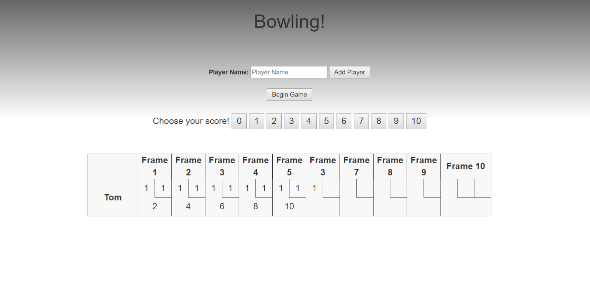
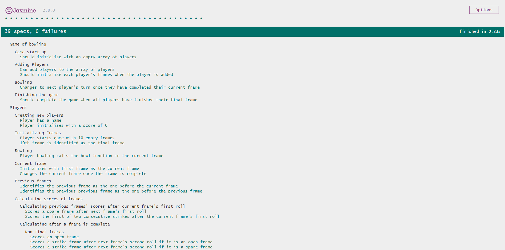

Bowling Challenge
=================

## Description

A pure javascript web app that calculates the scores for a game of bowling for one or more players.

For a refresher on the rules of bowling, please check out the [rules](#Rules)

For details about my [process](#design-process), [tests](#running-tests) and [retrospective](#retrospective), please visit the relevant sections!

## Setup

Clone the repository in the command line using the command 

`git clone https://github.com/Mnargh/bowling-challenge.git`

## Usage

To launch the app, open 'bowling.html' in the browser by right clicking on the file, and 'selecting open in browser'.

## Running tests

Testing is in Jasmine. To run the tests, open 'SpecRunner.html' in the browser.

## Design Process

I began my planning for the program by establishing what classes would be necessary for a fully functioning single player game, and the responsibilities each class would have.

Some basic diagrams of the methods and responsibilities of each class helped clarify what the architecture of the program would look like. 

## Retrospective 

### What went well

* Separating the responsibilities of each component of the game in to its own class helped with understanding the overall challenge and breaking it down in to smaller problems to be solved step by step.

* Implicating above and beyond the specification of the challenge, by enabling multiple player to play in the same game. Each player takes turns to bowl in the normal style.

* I was also pleased with managing to implement a running total that would only be calculated and displayed when actually possible given the scores a player had made i.e. a strike frame score would only appear once that frame's individual score could be calculated with the next two rolls.

### What could be better

   * Large portions of the code need refactoring, in particular the updateFrameScore function in the player class which is a behemoth of if statements at present. This is quite horrendous and definitely needs examining for shared behaviour to be refactored out.

   * The frame score table is hard coded to be an entire component in itself. A function could be created to build up a frame box, and called multiple times to create the full table.

* Currently, only the score of the first player appears in the frame scores table, and those of the other players can only be seen in the console.

### What I would do with more time

   * Add a theme and make the page look beautiful
   * Make the interface more user friendly
   * Complete the framescore table so that it also displays the score of the other players
   * A victory message for the winner
   * Check for more edge cases
   * Refactor 
   * Set up [Travis CI](https://travis-ci.org) to run tests.
   * Add [ESLint](http://eslint.org/) to your codebase and make the code conform.

## Rules

A bowling game consists of 10 frames in which the player tries to knock down the 10 pins. In every frame the player can roll one or two times. The actual number depends on strikes and spares. The score of a frame is the number of knocked down pins plus bonuses for strikes and spares. After every frame the 10 pins are reset.

### Strikes

The player has a strike if he knocks down all 10 pins with the first roll in a frame. The frame ends immediately (since there are no pins left for a second roll). The bonus for that frame is the number of pins knocked down by the next two rolls. That would be the next frame, unless the player rolls another strike.

### Spares

The player has a spare if the knocks down all 10 pins with the two rolls of a frame. The bonus for that frame is the number of pins knocked down by the next roll (first roll of next frame).

### 10th frame

If the player rolls a strike or spare in the 10th frame they can roll the additional balls for the bonus. But they can never roll more than 3 balls in the 10th frame. The additional rolls only count for the bonus not for the regular frame count.

    10, 10, 10 in the 10th frame gives 30 points (10 points for the regular first strike and 20 points for the bonus).
    1, 9, 10 in the 10th frame gives 20 points (10 points for the regular spare and 10 points for the bonus).

### Gutter Game

A Gutter Game is when the player never hits a pin (20 zero scores).

### Perfect Game

A Perfect Game is when the player rolls 12 strikes (10 regular strikes and 2 strikes for the bonus in the 10th frame). The Perfect Game scores 300 points.

In the image below you can find some score examples.

More about ten pin bowling here: http://en.wikipedia.org/wiki/Ten-pin_bowling

